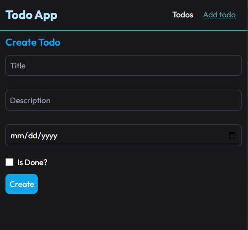
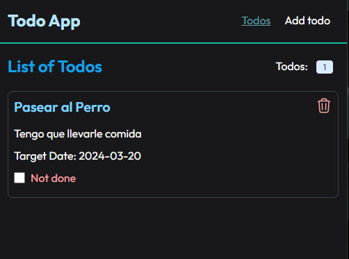

# Todo App | Redux Toolkit | RTK Redux

***Description:***

This is a simple Todo App using Redux Toolkit. It is a simple app that allows you to add, remove, and toggle todos. It also has a filter to show all, active, or completed todos.

***Features:***

- Add a todo
- Remove a todo
- Upate a todo

***Tech Stack:***

- React
- Redux Toolkit
- RTK Query
- Styled Components
- React Router
- Tailwind CSS

***Installation:***

1. Clone the repository
2. Run `npm install` to install the dependencies
3. Run `npm run dev` to start the development server with the mock server

***Demo:***

Form Todo

List Todo

